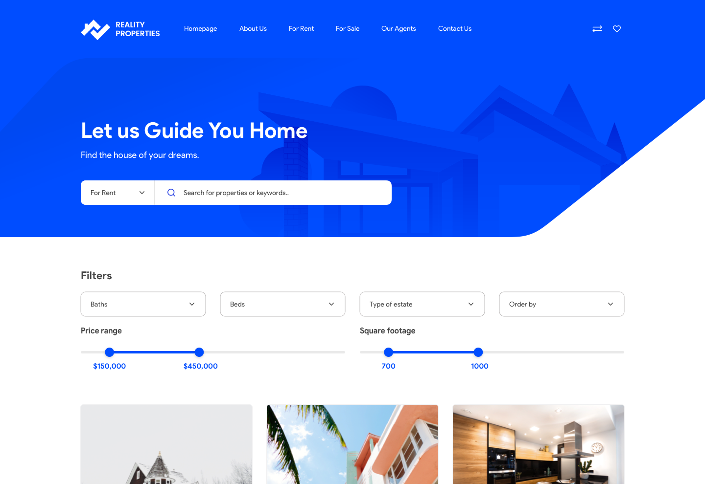

# Frontend Recruitment Task

Hey there,

Thanks for participating the recruitment process @ Clean Commit! This short task is intended to test your ability to build a simple landing page using modern technologies.

## Task

We have to create a mini app for our clients. Can you ship it?

The design can be found in sources library in .sketch and .fig in sources directory.
Our designers work mostly with Figma, but you can choose whichever you like!

Please use data from this [Google Sheet](https://docs.google.com/spreadsheets/d/e/2PACX-1vRAeVzfe5Xd7y_Ojzl5BxYSTDezszUfCj5PyV_lEYDPsRCX3Ze6F_YTNteG14X_Lf7FqEtHrI7m29nt/pubhtml)

## Requirements

Users should be able to search data by title and location (text-matching), and use filters in the design.

## Rules & Hints

1. Please use Next.js to complete the task.
2. Use Tailwind as your framework
3. Styles should be written in Tailwind CSS.
4. Adding content to Netlify CMS or any other headless CMS is a plus!
5. Pay attention to code quality, formatting, conventions etc. (Your code is your business card)
6. Make sure to fetch the Google sheets data for the mini app
7. Send us the link to the site, access to your repo, and CMS to check out your work!
